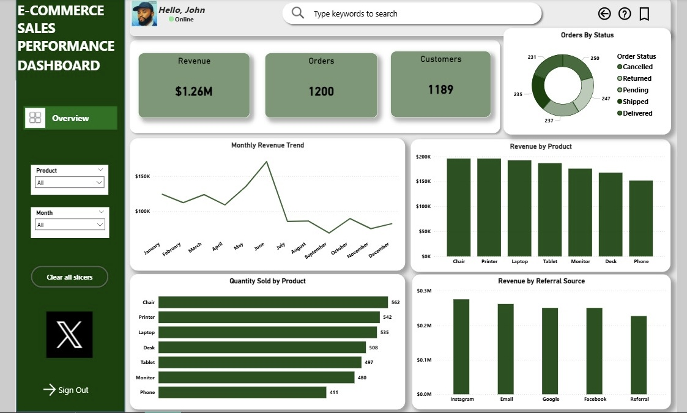

E-commerce Sales Performance Dashboard

An interactive Power BI dashboard designed to analyze e-commerce sales performance and provide clear insights into revenue, products, customers, and referral sources.

Project Overview

This project explores e-commerce sales data to understand overall business performance, identify high-performing products and referral sources, and examine revenue trends over time.

Key Metrics

* Revenue: $1.26M
* Orders: 1,200
* Customers: 1,189

Business Questions

The dashboard was designed to answer questions such as:

* How is revenue changing over time?
* Which products generate the most revenue?
* Which products have the highest quantity sold?
* Which referral sources generate the most revenue?
* What is the distribution of order statuses?

Dashboard Features

* Monthly revenue trend
* Revenue by product
* Quantity sold by product
* Revenue by referral source
* Order-status distribution
* KPI cards for revenue, orders, and customers

Key Insights

* Revenue peaks around June before declining from July onward.
* Chair and Printer are the highest-revenue products shown in the dashboard.
* Instagram is the highest-revenue referral source shown.

Tools Used

* Power BI
* Data cleaning and transformation
* Data analysis
* Data visualization
* Business intelligence and reporting

Dashboard Preview

Project File

The Power BI .pbix file is included in this repository for reference.

⸻

Created by John Ubi
Data Analyst | Power BI | Excel | Power Query | SQL
